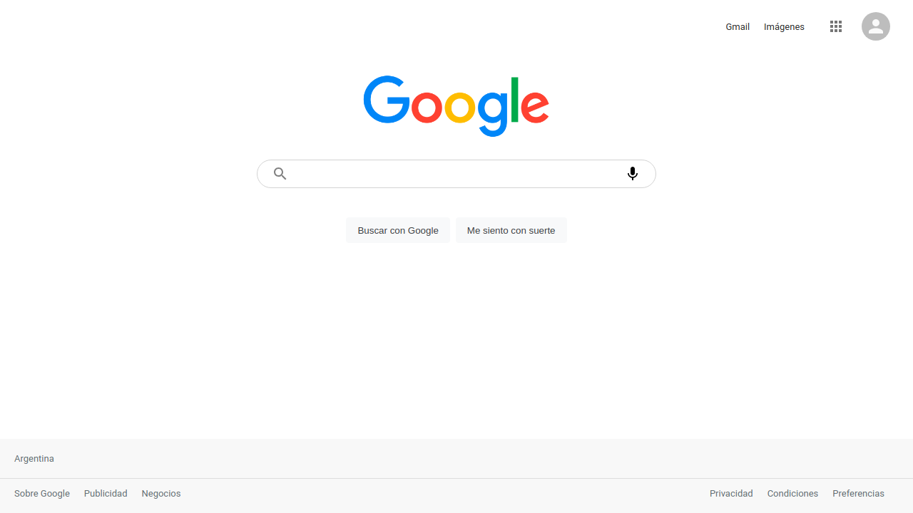
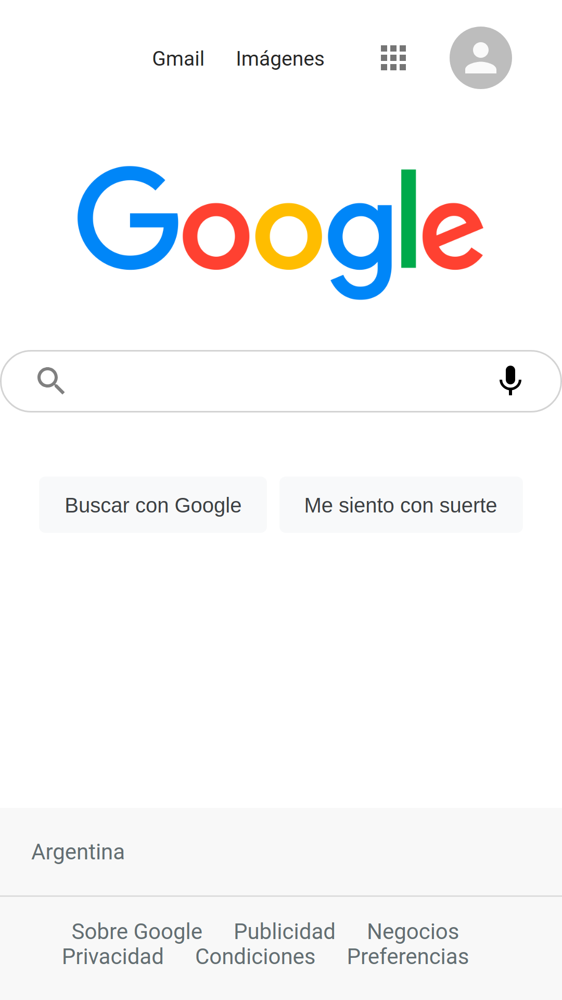

# Google Clone App

## Descripción

Código base de la aplicación Google Clone App hecha en React.js y Redux que utiliza la API de Google.

---

## Vista En Versión Desktop

## Vista En Versión Mobile

---

## Enlace A La Aplicación

- [Google Clone](https://axe10rellanaclondegoogle.netlify.app/#/)

---

## Hecho con

- [React](https://react.dev/) - JS library
- [Redux](https://redux.js.org/) - For state management

---

## Comandos

- npm i
- npm start
- npm run build

---

## Dependencias

- React
- Redux

---

## Autor

- Website - [Axe10rellana](https://axe10rellana.github.io/portafolio/portafolio/)

